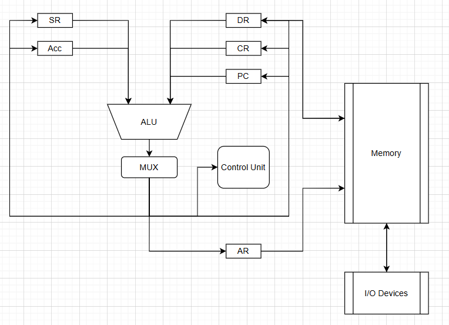
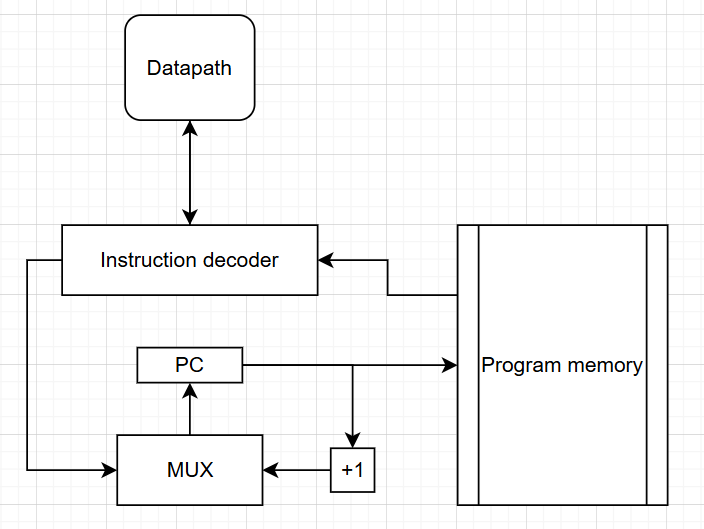

# Processor Architecture Experiments

`Степанов Арсений Алексеевич - P3318 - 368849`

This repository contains my solutions to the CSA Lab #3, all the solutions and
submissions are located here

## Submissions

- `acc32 - hello_user_pstr`: [Wrench Submission V0.0.3.1](https://wrench.edu.swampbuds.me/report/d068ea6b-09d2-4d0a-9883-ff8e59a2e970)
- `f32a - count_leading_zeros`: [Wrench Submission V0.0.3.1](https://wrench.edu.swampbuds.me/report/68cfb278-872d-41a9-9f59-ea32a8531942)
- `risc-iv-32 - sum_n`: [Wrench Submission V0.0.3.1](https://wrench.edu.swampbuds.me/report/bad0ba0a-8d82-4769-a5aa-1337d395c6fb)
- `m68k - rle_decompress_bytes`: [Wrench Submission V0.0.3.1](https://wrench.edu.swampbuds.me/report/5b3f81a6-5161-4882-bb37-1fcd4f01a8da)

## Schema

### Datapath

  

### Control Unit

  

